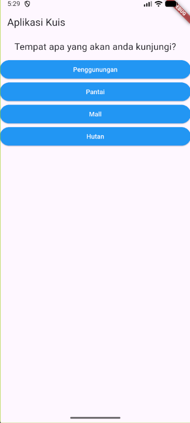
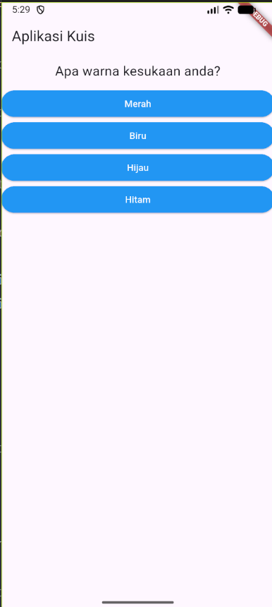
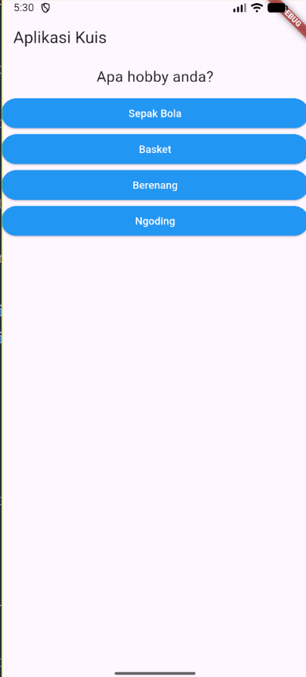
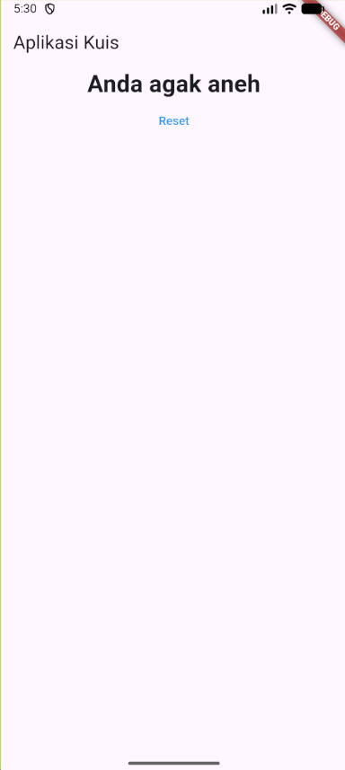

# 🧠 Aplikasi Kuis Kepribadian

Aplikasi kuis sederhana berbasis Flutter yang menilai kepribadian pengguna melalui beberapa pertanyaan. Setiap jawaban memiliki skor, dan total skor akan menampilkan hasil yang berbeda.

Dibangun sebagai proyek belajar Flutter tiga tahun lalu, kini diperbarui agar kompatibel dengan Flutter versi terbaru.

## 📸 Pratinjau

<!-- Ganti dengan tangkapan layarmu sendiri, usahakan tiga gambar berjejer horizontal -->
<p align="center">
  
  
  
  
</p>

## ✨ Fitur

- Tiga pertanyaan dengan empat pilihan jawaban
- Skor menumpuk untuk menentukan hasil akhir
- Teks hasil bervariasi: “Anda hebat sekali” hingga “Anda sangat jahat”
- Tombol **Reset** untuk mengulang kuis
- UI responsif sederhana dengan Material Design

## 🚀 Cara Menjalankan

1. Pastikan Flutter sudah terinstal (`flutter doctor` tanpa error).
2. Clone repositori ini:
   ```bash
   git clone https://github.com/<username>/flutter-kuis-kepribadian.git
   cd flutter-kuis-kepribadian
   ```
3. Jalankan:
   ```bash
   flutter pub get
   flutter run
   ```
4. Jika menggunakan emulator Android, pastikan emulator sudah berjalan.

## 🎮 Cara Menggunakan

1. Ketika aplikasi terbuka, kamu akan melihat pertanyaan pertama.
2. Pilih salah satu jawaban dengan menekan tombol biru.
3. Lanjutkan ke pertanyaan berikutnya.
4. Setelah semua pertanyaan terjawab, hasil akan ditampilkan.
5. Tekan tombol **Reset** untuk mengulang kuis dari awal.

## 🛠 Mengatasi Error Umum

Proyek ini awalnya dibuat 3 tahun lalu, sehingga beberapa penyesuaian diperlukan untuk Flutter versi terbaru. Jika kamu mengalami error berikut, ikuti langkahnya:

### 1. Error “Unsupported class file major version 65”

**Penyebab:** Gradle tidak kompatibel dengan Java versi terbaru.
**Solusi:** Perbarui `android/gradle/wrapper/gradle-wrapper.properties`:

```properties
distributionUrl=https\://services.gradle.org/distributions/gradle-8.5-all.zip
```

### 2. Error “app_plugin_loader Gradle plugin imperatively…”

**Penyebab:** Format `settings.gradle` masih lawas.
**Solusi:** Ubah isi `android/settings.gradle` menjadi format deklaratif. Contoh:

```gradle
pluginManagement {
    ...
}
plugins {
    id "dev.flutter.flutter-plugin-loader" version "1.0.0"
    id "com.android.application" version "8.1.0" apply false
    id "org.jetbrains.kotlin.android" version "1.9.0" apply false
}
include ":app"
```

Hapus blok `buildscript` dari `android/build.gradle`.

### 3. Error “Kotlin version (1.7.10) is lower than Flutter's minimum…”

**Penyebab:** Versi Kotlin terlalu rendah.
**Solusi:** Di `android/settings.gradle`, ubah:

```gradle
id "org.jetbrains.kotlin.android" version "1.9.0" apply false
```

### 4. Build berjalan sangat lama pertama kali

Wajar jika Gradle sedang mengunduh distribusi dan dependencies (~120 MB). Pastikan koneksi internet stabil. Jika masih timeout, unduh manual `gradle-8.5-all.zip` dan letakkan di folder cache Gradle.

Kemudian selalu jalankan:

```bash
flutter clean
flutter pub get
flutter run
```

## 📁 Struktur Proyek

```
lib/
├── main.dart         # State utama, daftar soal, dan navigasi
├── pertanyaan.dart   # Widget untuk teks pertanyaan
├── jawaban.dart      # Widget tombol jawaban
├── kuis.dart         # Widget yang menyatukan soal dan jawaban
└── hasil.dart        # Widget hasil akhir dan reset
```

## 📝 Lisensi

Proyek ini dibuat untuk pembelajaran. Silakan digunakan sesuai kebutuhan.
